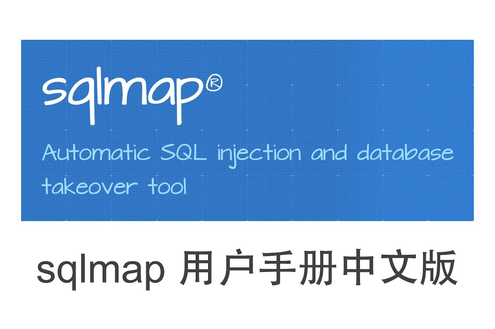

# sqlmap 用户手册中文版

[](https://github.com/kvko/sqlmap-wiki-zhcn)
[](https://github.com/kvko/sqlmap-wiki-zhcn/commits/master)



[repo]: https://github.com/kvko/sqlmap-wiki-zhcn
[host]: https://sqlmap.highlight.ink/

GitBook 页面: [sqlmap.highlight.ink][host]

本文档包含 sqlmap 项目 Wiki 的完整翻译，并将持续跟进。

获取官方 Wiki 仓库：

```shell
git clone https://github.com/sqlmapproject/sqlmap.wiki.git
```

当前译版：

| 日期               | Commit ID                                  |
| ------------------ | ------------------------------------------ |
| `2022-01-03 18:43` | `fc1a8e4035f579b6a44f3e3c5e5c7585b604fc61` |

## sqlmap 官方站点

* 官方网站：[sqlmap.org](http://sqlmap.org/)
* GitHub 仓库：[github.com/sqlmapproject/sqlmap](https://github.com/sqlmapproject/sqlmap)
* 用户手册：[sqlmap Wiki](https://github.com/sqlmapproject/sqlmap/wiki)

## 什么是 sqlmap？

sqlmap 是一款自动化检测与利用 SQL 注入漏洞的免费开源工具。

### 如何学习使用 sqlmap？

除了阅读本文档，你还可以结合 [sqli-labs](https://github.com/Audi-1/sqli-labs)
（一个 SQL 注入实验系统）来实践 sqlmap。

## 参与翻译

本文档发布在 [GitBook][host]，你可以访问 [sqlmap-wiki-zhcn (GitHub)][repo]
参与翻译，帮助我们修正翻译错误、提升翻译质量。

当你发现任何可改进之处，请 Fork 本项目并向我们发起 Pull Request，流程参见：[复刻他人项目](https://itechub.gitbook.io/github-guides-zhcn/forking-projects/intro)。

### 格式约定

原则上使用 [中文文案排版指北](https://github.com/mzlogin/chinese-copywriting-guidelines) 中建议的格式。

重点关注的几点：

1. 标点符号：使用中文标点符号，代码则沿用英文原文。
2. 中文和英文、数字之间用空格隔开。例如：这是 1 份 sqlmap 中文文档。
3. 专有名词一般不翻译，如 Google。

水平所限，难免出现纰漏，欢迎任何指正、建议、意见和批评。

### 译者

* [Octobug](https://github.com/Octobug)
* [Shady](https://github.com/shady-robot)
